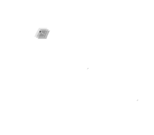
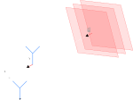

In this article I will explain how the steering vector (or spatial signature) of a uniform planar area can be derived in a very simple and visual way.

Let’s start by writing down the frequency response $h$ of a single receive antenna:

$$
h = \alpha e^{-j(2\pi f\tau + \phi)}.
$$

In wireless communications, the wavefronts of an antenna emitting in all directions are spherical. However, one can assume that when the distance to the transmitter is sufficiently big, the wavefronts can be reasonably approximated by planes. In other words, the curvature of the sphere of big radius is small enough for the local patches to be approximated by their tangent planes, as show on figure 1. This assumption greatly simplifies calculations. One can observe that a plane wave travels in the direction normal to its plane, represented by the unit vector $\vec{u}$. In the case of the plane wave model, this direction is aligned with the radius of the sphere.

Let’s now start by considering two receive antennas $A$ and $B$ close enough to each other on the scale of the wavelength. Antenna $A$ is placed at the origin of a three-dimensional Cartesian space while antenna $B$ is at position $\vec{p}$ as shown on the figure bellow.

The frequency responses $h_1$ and $h_2$ corresponding to the first and second antenna respectively are as follows:

$$
h_1=\alpha e^{-j\phi}e^{-j2\pi f\tau} \quad \text{and} \quad h_2=\alpha e^{-j\phi}e^{-j2\pi (f\tau+\frac{d}{\lambda})},
$$

where $d$ is the distance the wave needs to further travel from the first antenna to attain the second antenna, assuming it is small enough for $\alpha$ to remain unchanged.

The objective now is to determine this distance knowing the position $\vec{p}$ of antenna $B$ relative to antenna $A$, and the direction of arrival (DoA) of the wave $\vec{u}$ (i.e. the unit normal to the wave plane). If the antenna $B$ is placed such that $\vec{p}$ is aligned with $\vec{u}$, then this distance is exactly the norm of $\vec{p}$ (i.e., $d=\Vert\vec{p}\Vert$). In the more general case however, this is not true. Luckily, we can easily derive the true quantity using simple geometry. Indeed, the distance $d$ is simply the distance between the two antennas orthogonally projected on the direction of travel of the wave:


$$
\begin{equation}
d = \vec{p}.\vec{u}.
\label{eq:distance}
\end{equation}
$$


<aside>
💡 If the signal reaches an antenna first before reaching the reference antenna, then the phase shift is negative, in which case we accept the abuse of terminology where a "distance" can be negative to reflect the distance the wave traveled from one point to the reference point. This works out well in this case as the scalar product changes sign.
</aside>

In the case of an antenna array, the same principle holds: for each antenna, the objective is finding the distance the wave needs to further travel from one reference antenna to the rest of the antennas. Formally, for a UPA of size $N\times M$, we define a matrix $\mathbf{D}$ of those distances where each element corresponds to one antenna:


$$
\mathbf{D}=\begin{bmatrix} 
    d_{1,1} & \dots  & d_{1,M}\\
    \vdots & \ddots & \vdots\\
    d_{N,1} & \dots  & d_{N,M} 
    \end{bmatrix}.
$$


For ease of notation, let's take the top left antenna as reference. It follows that $d_{1,1}=0$. Using $\eqref{eq:distance}$ we have:


$$
\mathbf{D}=\begin{bmatrix} 
    \vec{p}_{1,1}.\vec{u} & \dots  & \vec{p}_{1,M}.\vec{u}\\
    \vdots & \ddots & \vdots\\
    \vec{p}_{N,1}.\vec{u} & \dots  & \vec{p}_{N,M}.\vec{u} 
    \end{bmatrix}.
$$


In the case of UPAs, the array elements are usually separated by half a wavelength both horizontally and vertically, meaning that if the array belongs to the $xz$-plane, then $\vec{p}_{m,n}=(-(m-1)\frac{\lambda}{2},0,-(n-1)\frac{\lambda}{2}),\ n\in[1..N],m\in[1..M]$.

On the other hand, $\vec{u}$ is equivalently represented by the azimuth and elevation angles of arrival, noted $\theta$ and $\varphi$ respectively. Converting from polar to Cartesian coordinates, we obtain $\vec{u}=(-\cos{\varphi}\cos{\theta},-\cos{\varphi}\sin{\theta},-\sin{\varphi})$. Finally, we obtain $\vec{p}_{m,n}.\vec{u}=(m-1)\frac{\lambda}{2}\cos \varphi \cos \theta + (n-1)\frac{\lambda}{2}\sin \varphi\$. Matrix $\mathbf{D}$ then becomes:


$$
\mathbf{D}=\begin{bmatrix} 
    0 & \dots  & (M-1)\frac{\lambda}{2}\cos \varphi \cos \theta\\
    \vdots & \ddots & \vdots\\
    (N-1)\frac{\lambda}{2}\sin \varphi & \dots  & (M-1)\frac{\lambda}{2}\cos \varphi \cos \theta + (N-1)\frac{\lambda}{2}\sin \varphi 
    \end{bmatrix}.
$$


This form greatly simplifies the expression of the channel matrix $\mathbf{H}$ of the UPA:


$$
\mathbf{H}=\alpha e^{-j\phi}e^{-j2\pi f\tau}e^{-j\frac{2\pi}{\lambda}\mathbf{D}},
$$


where the last exponential is the element-wise operator.

One can then observe that $e^{-j\frac{2\pi}{\lambda}\mathbf{D}}$ can be written as the Kronecker product of two unit vectors:


$$
e^{-j\frac{2\pi}{\lambda}\mathbf{D}} = \sqrt{NM}\mathbf{a}_h(\vec{u})^\top\otimes\mathbf{a}_v(\vec{u}),
$$


where $\mathbf{a}_h(\vec{u})=\frac{1}{\sqrt{M}}(1,\dots,e^{(M-1)\pi\cos{\varphi}\cos{\theta}})^\top$ and $\mathbf{a}_v(\vec{u})=\frac{1}{\sqrt{N}}(1,\dots,e^{(N-1)\pi\sin{\varphi}})^\top$. These are called the **steering vectors** (or spatial signatures) of the antenna array. They are a function of the direction of arrival of the signal and fully describe the system. They are a convenient way to represent $\mathbf{H}$ whom final expression is:


$$
\mathbf{H}=\sqrt{NM}\alpha e^{-j\phi}e^{-j2\pi f\tau}\mathbf{a}_h(\vec{u})^\top\otimes\mathbf{a}_v(\vec{u}).
$$


It is worth noting that the same procedure could be used to derive the formula for different configurations of antenna arrays (ULA, circular, cylindrical, etc.).

Because I believe that visualization greatly helps for geometrical concepts such as the one presented in this article, here's an interactive figure of a UPA showing the distance $d$ (green segment) of one of its antenna elements (blue dots) to the wavefront (blue plane). You can move the red dot around to see how $d$ changes depending on the direction of arrival. Note that in this case the reference antenna is the one at the center of the array.

